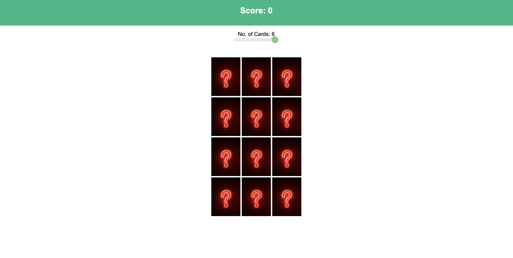
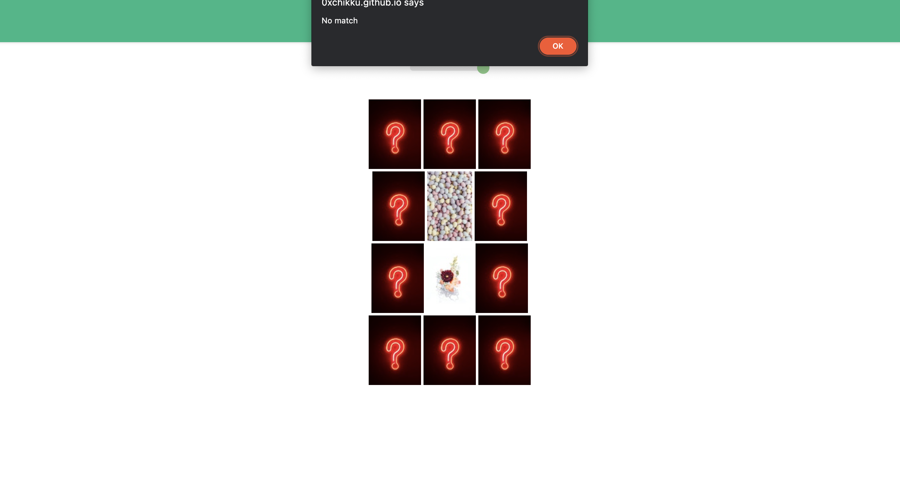
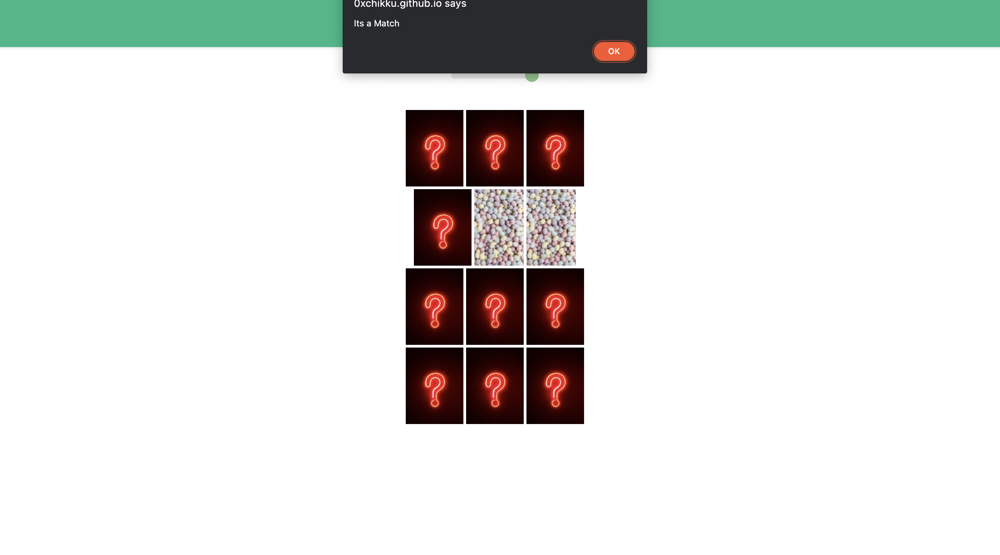

# Memory Game

## Overview

This is a simple memory game where players have to match pairs of cards with the same image.
The game starts with all cards face down, and players take turns flipping over two cards at a time to try and find a match.
If the two cards match, the player gets a point.
If the two cards do not match, they are flipped face down again.
The game ends when all pairs have been found.
The player can adjust the number of cards they want to play with.

## Technologies Used

This game is built using HTML, CSS, and JavaScript.

## Live Game

You can play the game live by visiting this [link](https://0xchikku.github.io/MemoryGame/)

## How to Play

You can start playing by clicking on two cards to flip them over.
If the two cards match, you will earn a point.
If the two cards do not match, they will flip back over.
The game ends when all pairs have been found.

## UI Description

The game board is a grid of cards, with each card containing an image hidden on the other side.
Players can click on a card to reveal the image, and then click on a second card to see if it matches the first one.
If the two cards match, the player earns a point.
If the two cards do not match, they are flipped back over.
The game also includes a score counter, a reset button to start a new game, and a message to indicate when the game is over.

## Features

This memory game includes the following features:

- A randomized game board with different cards each time you play
- Simple and intuitive game play
- Automatic scoring and game end detection
- Fun and colorful card designs

## Contributing

Contributions to this game are welcome! If you find a bug, have an idea for a new feature, or want to help improve the code, feel free to fork the repository and submit a pull request on [Github](https://github.com/0xchikku/MemoryGame).

## 📩 Reach Out

**Mail :** [dritesh484@gmail.com](mailto:dritesh484@gmail.com)  
**Twitter :** [Rdchikku](https://twitter.com/Rdchikku_)  
**LinkedIn :** [Ritesh Dubey](https://www.linkedin.com/in/ritesh-dubey-1a54a4215/)
